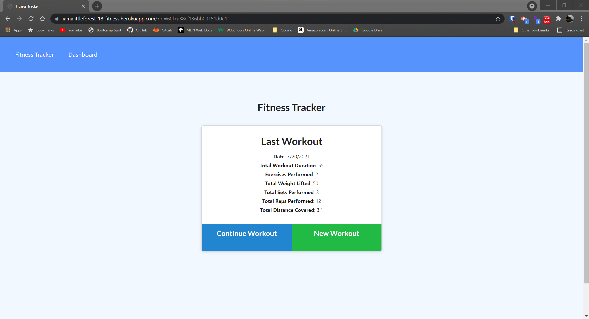
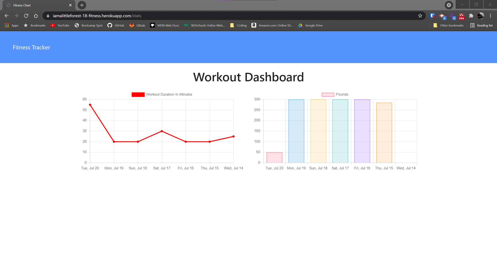

# Fitness Tracker

## Link
https://iamalittleforest-18-fitness.herokuapp.com/

## Languages & Technologies
* HTML / CSS / Javascript
* Express 
* MongoDB
* Mongoose 
* Morgan 
* Heroku 
* MongoDB Atlas

## Description
Fitness Tracker is an application that enables a user to view, create, and track daily workouts. The application also has a dashboard feature that displays  historical views of the total duration and total weight of each workout.  

## Screenshot

## License
MIT License

## Contact Information
Wendy Kobayashi 
* Email: <wykobayashi@gmail.com>
* LinkedIn: <https://www.linkedin.com/in/wendy-kobayashi/>